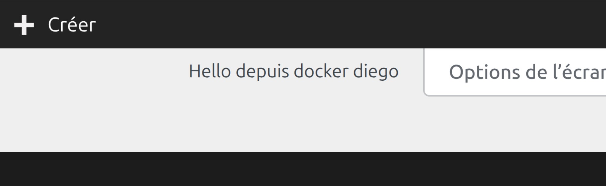
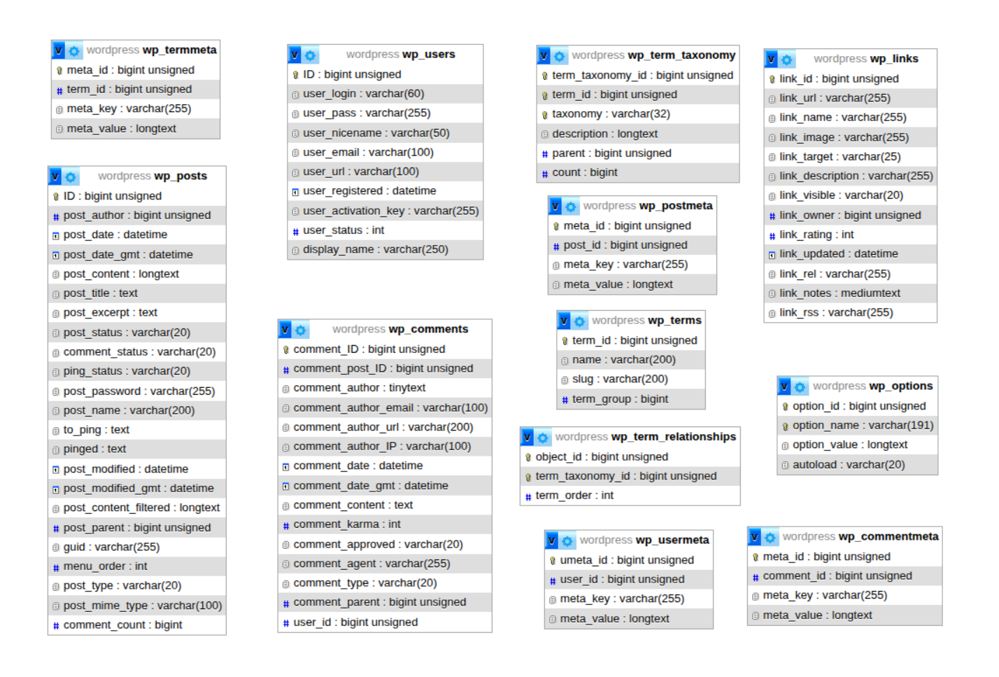

# **Première partie : à propos de WordPress**

### Qu’est-ce que WordPress ?

WordPress est un système de gestion de contenu créé le 27 mai 2003 par Matt Mullenweg et Mike Little, à partir d'un logiciel de blog abandonné appelé b2.

### WordPress est-il beaucoup utilisé ?

Oui, il est de loin le CMS le plus utilisé au monde, avec environ 33 pourcent de tous les sites web sur Internet en 2026, loin devant son concurrent Shopify à 4,7 pourcent.

### Combien coûte WordPress ?

Ça dépend de la version, WordPress propose un plan gratuit et des plans payants d'environ 7 CHF à 57 CHF par mois, voire plus pour les gros sites. WordPress.org est gratuit en tant que logiciel, mais il faut payer l'hébergement, environ 2 CHF à 24 CHF par mois, et un nom de domaine.

### Quelle est la différence entre wordpress.com et wordpress.org ? 

Wordpress.com héberge tout pour nous, mais avec des limites sur les plugins, thèmes et l'accès aux fichiers selon le plan. wordpress.org s'installe lui-même chez l'hébergeur de son choix, avec un contrôle total mais plus de gestion technique pour lui.

### Quest-ce qu'un CMS ? 

Un CMS est un logiciel qui permet de créer et gérer un site web sans avoir à écrire le code à la main. Il sépare le contenu, les textes et les images, de la présentation, le design du site, ce qui permet de publier une page depuis une simple interface d'administration au lieu de coder chaque page en HTML. WordPress est le CMS le plus utilisé au monde.


# **Deuxième partie : installation locale**


### 2.1 Installation de LAMP

**L**inux - **A**pache - **M**ariaDB - **P**hp 

```
lsb_release -a
```

(vérifie la version d'Ubuntu installée)

```
sudo apt update
sudo apt install apache2
sudo systemctl enable apache2
sudo systemctl status apache2
```
(installe le serveur web Apache et vérifie qu'il fonctionne)
```
sudo apt install php8.5 libapache2-mod-php8.5 php8.5-mysql php8.5-xml php8.5-gd php8.5-curl php8.5-mbstring php8.5-zip
php -v
sudo apt install mariadb-server mariadb-client
```
(installe PHP et ses modules nécessaires à WordPress)

---

### 2.2 Création de la base de données WordPress

```
sudo mysql
CREATE DATABASE wordpress;
CREATE USER 'wpuser'@'localhost' IDENTIFIED BY 'un_mot_de_passe_solide';
GRANT ALL PRIVILEGES ON wordpress.* TO 'wpuser'@'localhost';
FLUSH PRIVILEGES;
EXIT;
```
(Cette commande se connecte à MariaDB, crée la base de données "wordpress", crée un utilisateur "wpuser" avec un mot de passe, lui donne tous les droits sur cette base, applique les changements puis quitte la console MySQL.)

---

### 2.3 Téléchargement, configuration Apache et finalisation de l'installation WordPress

**Téléchargement et préparation des fichiers WordPress**

```
wget -O- https://wordpress.org/latest.tar.gz | sudo tar -xz -C /var/www
sudo chown -R www-data:www-data /var/www/wordpress
```

(télécharge la dernière version de WordPress et l'extrait dans le dossier web, puis donne les bons droits d'accès à Apache sur ces fichiers)

**Configuration d'Apache pour servir WordPress**

```
sudo cp /etc/apache2/sites-available/000-default.conf /etc/apache2/sites-available/wordpress.conf
sudo nano /etc/apache2/sites-available/wordpress.conf
```

**ServerName** - ServerName localhost

**DocumentRoot** - changé de /var/www/html vers /var/www/wordpress

Ajout d'un bloc Directory juste avant `VirtualHost`, pour autoriser les fichiers .htaccess (nécessaire pour les permaliens WordPress) :

```
<Directory /var/www/wordpress/>
        AllowOverride All
</Directory>
```

(modification de DocumentRoot en /var/www/wordpress et ServerName en localhost)

```
sudo a2ensite wordpress.conf 
sudo a2dissite 000-default.conf
sudo a2enmod rewrite
sudo systemctl reload apache2
```

(création d'un fichier de configuration dédié pointant vers le dossier de WordPress, puis activation du site)

**Finalisation via le navigateur**

(accèder à **http://localhost/** pour suivre l'assistant d'installation de WordPress avec les identifiants de la base de données créés précédemment dans MariaDB)

---

### 2.4 Références utilisées

[LinuxConfig - Installing WordPress on a LAMP Stack in Ubuntu 24.04](https://linuxconfig.org/installing-wordpress-on-a-lamp-stack-in-ubuntu-24-04)

[Tecmint - How to Install LAMP Stack on Ubuntu 24.04](https://www.tecmint.com/install-lamp-stack-ubuntu/)

[WordPress.org - Requirements](https://wordpress.org/about/requirements/)

---

### 2.5 De quoi WordPress a-t-il besoin pour fonctionner ?

PHP, une base de données MySQL ou MariaDB, un serveur web comme Apache, et idéalement une connexion HTTPS

---

### Que sont LAMP, MAMP, WAMP et XAMPP ?

**LAMP** (Linux, Apache, MySQL/MariaDB, PHP) : la combinaison installée dans mon cas, sur Linux, en installant chaque brique séparément avec apt.

**WAMP** (Windows, Apache, MySQL, PHP) : le même principe, mais sur Windows. installable avec WampServer, qui installe Apache, MySQL et PHP en une seule fois avec une interface graphique.

**MAMP** (macOS, Apache, MySQL, PHP) : la même chose pour Mac, avec l'application MAMP, aussi tout-en-un.

**XAMPP** (X = multiplateforme, Apache, MySQL/MariaDB, PHP) : une version qui fonctionne sur Windows, Mac ET Linux à la fois.

# Troisième partie : installation distante

## Procédure d’installation de WordPress sur une VM distante

### 3.1 Installation de LAMP

**L**inux - **A**pache - **M**ariaDB - **P**hp 

```
lsb_release -a
```

(vérifie la version d'Ubuntu installée)

```
sudo apt update
sudo apt install apache2
sudo systemctl enable apache2
sudo systemctl status apache2
```
(installe le serveur web Apache et vérifie qu'il fonctionne)
```
sudo apt install php8.5 libapache2-mod-php8.5 php8.5-mysql php8.5-xml php8.5-gd php8.5-curl php8.5-mbstring php8.5-zip
php -v
sudo apt install mariadb-server mariadb-client
```
(installe PHP et ses modules nécessaires à WordPress)

---

### 3.2 Création de la base de données WordPress

```
sudo mysql
CREATE DATABASE wordpress;
CREATE USER 'wpuser'@'localhost' IDENTIFIED BY 'un_mot_de_passe_solide';
GRANT ALL PRIVILEGES ON wordpress.* TO 'wpuser'@'localhost';
FLUSH PRIVILEGES;
EXIT;
```
(Cette commande se connecte à MariaDB, crée la base de données "wordpress", crée un utilisateur "wpuser" avec un mot de passe, lui donne tous les droits sur cette base, applique les changements puis quitte la console MySQL.)

---

### 3.3 Téléchargement, configuration Apache et finalisation de l'installation WordPress

**Téléchargement et préparation des fichiers WordPress**

```
wget -O- https://wordpress.org/latest.tar.gz | sudo tar -xz -C /var/www
sudo chown -R www-data:www-data /var/www/wordpress
```

(télécharge la dernière version de WordPress et l'extrait dans le dossier web, puis donne les bons droits d'accès à Apache sur ces fichiers)

**Configuration d'Apache pour servir WordPress**

```
sudo cp /etc/apache2/sites-available/000-default.conf /etc/apache2/sites-available/wordpress.conf
sudo nano /etc/apache2/sites-available/wordpress.conf
```

**ServerName** - ServerName 86.119.28.233 (Ip de votre VM distante)

**DocumentRoot** - changé de /var/www/html vers /var/www/wordpress

Ajout d'un bloc Directory juste avant </VirtualHost>, pour autoriser les fichiers .htaccess (nécessaire pour les permaliens WordPress) :

```
<Directory /var/www/wordpress/>
        AllowOverride All
</Directory>
```

(modification de DocumentRoot en /var/www/wordpress et ServerName en localhost)

```
sudo a2ensite wordpress.conf 
sudo a2dissite 000-default.conf
sudo a2enmod rewrite
sudo systemctl reload apache2
```

(création d'un fichier de configuration dédié pointant vers le dossier de WordPress, puis activation du site)

**Finalisation via le navigateur**

(accèder à **http://86.119.28.233/ (Ip de votre VM distante)** pour suivre l'assistant d'installation de WordPress avec les identifiants de la base de données créés précédemment dans MariaDB)

# Image Site


---

### Que manque-t-il pour que mon site soit opérationnel ?

Il manque un nom de domaine.

Actuellement, le site est accessible uniquement via son adresse IP publique ce qui fonctionne techniquement mais présente plusieurs limites pour une mise en production réelle :

Accessibilité : une IP brute est difficile à mémoriser et peu professionnelle comparée à une URL type www.monsite.com
HTTPS impossible : l'obtention d'un certificat SSL (via Let's Encrypt par exemple) nécessite un nom de domaine - on ne peut pas sécuriser une connexion en HTTPS sur une simple IP
Les moteurs de recherche indexent mal les sites accessibles uniquement par IP
Crédibilité : un nom de domaine renforce la confiance des visiteurs

# Quatrième partie : développement avec Docker

### 4.1 Installation de Docker

```
sudo apt update
sudo apt install ca-certificates curl
sudo install -m 0755 -d /etc/apt/keyrings
sudo curl -fsSL https://download.docker.com/linux/ubuntu/gpg -o /etc/apt/keyrings/docker.asc
sudo chmod a+r /etc/apt/keyrings/docker.asc
```

(Installe la clé de sécurité de Docker sur la machine, pour que le système puisse vérifier que les paquets Docker sont authentiques avant de les installer)

```
sudo tee /etc/apt/sources.list.d/docker.sources <<EOF
Types: deb
URIs: https://download.docker.com/linux/ubuntu
Suites: $(. /etc/os-release && echo "${UBUNTU_CODENAME:-$VERSION_CODENAME}")
Components: stable
Architectures: $(dpkg --print-architecture)
Signed-By: /etc/apt/keyrings/docker.asc
EOF
```

(Enregistre le dépôt Docker dans les sources apt)

```
sudo apt install docker-ce docker-ce-cli containerd.io docker-buildx-plugin docker-compose-plugin
```
(Installe Docker)

### 4.2 Création du dossier de travail et du fichier docker-compose.yml

```
mkdir ~/wp-docker-kit
cd ~/wp-docker-kit
```
(Crée un dossier de travail dédié au kit de développement WordPress)

Fichier `docker-compose.yml` créé à la racine du dossier :

```
services:
db:
image: mysql:8.0
container_name: wp_db
restart: unless-stopped
environment:
MYSQL_ROOT_PASSWORD: rootpassword
MYSQL_DATABASE: wordpress
MYSQL_USER: wp_user
MYSQL_PASSWORD: wp_password
volumes:
- db_data:/var/lib/mysql
networks:
- wp_network

wordpress:
image: wordpress:latest
container_name: wp_app
restart: unless-stopped
depends_on:
- db
ports:
- "8080:80"
environment:
WORDPRESS_DB_HOST: db:3306
WORDPRESS_DB_NAME: wordpress
WORDPRESS_DB_USER: wp_user
WORDPRESS_DB_PASSWORD: wp_password
volumes:
- ./wp_html:/var/www/html
networks:
- wp_network

phpmyadmin:
image: phpmyadmin:latest
container_name: wp_phpmyadmin
restart: unless-stopped
depends_on:
- db
ports:
- "8081:80"
environment:
PMA_HOST: db
PMA_USER: root
PMA_PASSWORD: rootpassword
networks:
- wp_network

volumes:
db_data:
wp_data:

networks:
wp_network:
```

(Définit trois conteneurs : `db` pour la base de données MySQL, `wordpress` pour le CMS accessible sur le port 8080, et `phpmyadmin` pour l'administration de la base de données via navigateur sur le port 8081.)

### 4.3 Références utilisées

[Docker Hub - Image officielle WordPress](https://hub.docker.com/_/wordpress)

[Docker Hub - Image officielle MySQL](https://hub.docker.com/_/mysql)

[Docker Hub - Image officielle phpMyAdmin](https://hub.docker.com/_/phpmyadmin)

[docker/awesome-compose - Exemple officiel WordPress](https://github.com/docker/awesome-compose/tree/master/official-documentation-samples/wordpress)

[Documentation officielle Docker Compose](https://docs.docker.com/compose/)

### 4.4 Lancement des conteneurs

```
sudo docker compose up -d
```

(Télécharge les images puis démarre les trois conteneurs)

```
sudo docker compose ps
```
(Affiche l'état des conteneurs du projet, permet de vérifier que `wp_db`, `wp_app` et `wp_phpmyadmin` sont bien en cours d'exécution)

### 4.5 Accès aux services

WordPress est accessible sur **http://localhost:8080** (assistant d'installation au premier lancement).

phpMyAdmin est accessible sur **http://localhost:8081** avec l'utilisateur `root` et le mot de passe `rootpassword` défini dans le `docker-compose.yml`.

### 4.6 Qu'est-ce que Docker et en quoi diffère-t-il de la virtualisation ?

Docker est un outil qui permet d'empaqueter une application et tous ses outils dans un conteneur, qui peut tourner de façon identique sur n'importe quelle machine.

La virtualisation simule un ordinateur complet via un hyperviseur, chaque VM embarque son propre système d'exploitation, ce qui la rend lourde et lente à démarrer.

La conteneurisation, partage le noyau du système hôte et isole uniquement les processus, grâce aux mécanismes Linux. Un conteneur ne contient pas d'OS complet, seulement l'application et ses dépendances.

### 4.7 Dockerfile, Docker et Docker Compose : quelle différence ?

**Docker** c'est le moteur qui construit et exécute les conteneurs.

**Un Dockerfile** c'est un fichier texte contenant les étapes pour construire une image, quelle image de base utiliser, quoi installer, quels fichiers copier, quelle commande lancer au démarrage.

**Docker Compose** c'est un outil qui permet de gérer plusieurs conteneurs à partir d'un seul fichier `docker-compose.yml`, plutôt que de lancer chaque conteneur séparément avec des commandes `docker run`.

### 4.8 Ports, volumes et environnements

**Les ports** définissent une correspondance entre un port de la machine hôte et un port à l'intérieur du conteneur. Par exemple `8080:80` signifie que le port 80 du conteneur est accessible depuis la machine hôte via le port 8080.

**Les volumes** assurent la persistance des données en dehors du cycle de vie du conteneur. Sans volume, toutes les données écrites à l'intérieur d'un conteneur disparaissent lorsque celui-ci est supprimé. Un volume peut aussi être un dossier de la machine hôte monté directement dans le conteneur (bind mount), ce qui permet par exemple d'éditer un fichier depuis son propre éditeur tout en le voyant appliqué dans le conteneur.

**Les variables d'environnement** permettent de passer des paramètres de configuration au conteneur au démarrage (identifiants de base de données, mots de passe, etc.), sans les coder en dur dans l'image.

### 4.9 Entrer dans un conteneur

```
sudo docker exec -it wp_app bash
```

(Ouvre un terminal interactif à l'intérieur du conteneur `wp_app`, permettant d'exécuter des commandes directement dans son système de fichiers. L'option `-it` combine mode interactif et allocation d'un pseudo-terminal)

```
exit
```
(Quitte le terminal du conteneur et revient sur la machine hôte)

### 4.10 Ajout d'un plugin via un volume (Hello Dolly)

```
mkdir -p ~/wp-docker-kit/plugins/hello-dolly
cd ~/wp-docker-kit/plugins/hello-dolly
wget https://downloads.wordpress.org/plugin/hello-dolly.zip
unzip hello-dolly.zip
```

(Crée le dossier pour les plugins, télécharge l'archive officielle du plugin Hello Dolly depuis wordpress.org, et l'extrait)

Ajout d'une ligne dans la section `volumes` du service `wordpress` du fichier `docker-compose.yml` :

```
volumes:
  - wp_data:/var/www/html
  - ./plugins/hello-dolly:/var/www/html/wp-content/plugins/hello-dolly
```

(Monte le dossier local `plugins/hello-dolly` directement dans le dossier des plugins du conteneur WordPress.)

```
sudo docker compose up -d
```

(Redémarre les conteneurs avec la nouvelle configuration de volume appliquée)

Le plugin Hello Dolly est ensuite visible et activable depuis **Extensions** dans l'interface d'administration WordPress (**http://localhost:8080/wp-admin**).

### 4.11 Modification du plugin depuis la machine hôte

Le fichier `hello.php` du plugin a été modifié directement depuis VS Code sur la machine hôte (remplacement du tableau de citations `$lyrics` par un texte personnalisé), sans jamais entrer dans le conteneur.         

```
sudo docker exec wp_app cat /var/www/html/wp-content/plugins/hello-dolly/hello.php
```

(Permet de vérifier depuis l'extérieur que la modification faite sur la machine hôte est bien visible à l'intérieur du conteneur.)



### 4.12 Connexion à la base de données via un client SQL

Connexion à phpMyAdmin (accessible sur **http://localhost:8081**), configuré directement dans le `docker-compose.yml` avec les identifiants `root` / `rootpassword`, permettant une connexion automatique sans écran de login.

La base de données `wordpress` contient l'ensemble des tables générées par l'installation (utilisateurs, articles, commentaires, métadonnées, taxonomies, options, etc.), consultables et modifiables directement depuis l'interface.

### 4.13 Diagramme entité-association (ERD)

Diagramme de l'onglet **Designer** de phpMyAdmin, montrant l'ensemble des tables de la base `wordpress` et leurs relations (clés primaires, clés étrangères) :



# Cinquième partie : déploiement avec Docker (Ops)

### 5.1 Installation Docker sur VM

```
sudo apt update
sudo apt install ca-certificates curl
sudo install -m 0755 -d /etc/apt/keyrings
sudo curl -fsSL https://download.docker.com/linux/ubuntu/gpg -o /etc/apt/keyrings/docker.asc
sudo chmod a+r /etc/apt/keyrings/docker.asc
sudo tee /etc/apt/sources.list.d/docker.sources <<EOF
Types: deb
URIs: https://download.docker.com/linux/ubuntu
Suites: $(. /etc/os-release && echo "${UBUNTU_CODENAME:-$VERSION_CODENAME}")
Components: stable
Architectures: $(dpkg --print-architecture)
Signed-By: /etc/apt/keyrings/docker.asc
EOF
```

(Même etape que sur la machine locale, installation du moteur Docker et de ses plugins)

```
sudo docker run hello-world
```

(Vérifie que Docker fonctionne correctement sur la VM)

### 5.2 Récupération du kit de développement via Git

```
git config --global credential.helper store
git clone https://github.com/dieg0000000/stage-wordpress.git
```

(Configure Git pour mémoriser les identifiants d'authentification, puis clone le dépôt contenant le `docker-compose.yml` et le plugin développé localement)

### 5.3 Lancement de la stack WordPress en production

```
cd ~/stage-wordpress/wp-docker-kit
sudo docker compose up -d
```

(Démarre les trois conteneurs `wp_db`, `wp_app`, `wp_phpmyadmin`, comme en local, à partir du même fichier `docker-compose.ym
Le site est ensuite accessible via l'adresse IP publique de la VM sur le port 8080 : **http://86.119.28.233:8080**)

```
sudo docker compose ps
```

(Vérifie que les trois conteneurs sont bien à l'état "Up")

### 5.4 Mon déploiement en production est-il en tout point similaire à celui sur mon ordinateur ?

Oui, la procédure a été identique : même fichier `docker-compose.yml`, mêmes images Docker (`wordpress`, `mysql`, `phpmyadmin`), mêmes commandes de lancement. Seule différence : l'accès se fait via l'IP publique de la VM plutôt que `localhost`.


### 5.5 Est-on prêt pour la prod ?

**Emails** : WordPress a besoin d'envoyer des emails (mot de passe oublié, notifications, etc..). La fonction PHP mail() par défaut n'est pas fiable depuis un conteneur et nécessite une passerelle SMTP externe.

**HTTPS** : C'est un fichier délivré par une autorité de certification qui prouve qu'un site appartient bien au domaine qu'il prétend représenter (Https). Nécessite un nom de domaine. (Partie 3)

**PRA** : aucune sauvegarde automatisée actuellement, export régulier de la base MySQL + du dossier wp-content, stockés hors du serveur de production.

**Qu'est-ce qu'un SSO ?** Authentification unique, l'utilisateur se connecte une fois pour accéder à plusieurs applications, via un fournisseur d'identité central (Tequila ou Entra-ID)

### 5.6 Mise en place d'une passerelle SMTP

**Création d'un compte de test Mailtrap**

Inscription sur [mailtrap.io](https://mailtrap.io), puis récupération des identifiants SMTP depuis la Sandbox "My Sandbox" (onglet Integration) :

```
Host: sandbox.smtp.mailtrap.io
Port: 2525
Username: xxxxxxxxxxxxxx
Password: xxxxxxxxxxxxxx
```

(Mailtrap intercepte les emails envoyés par l'application dans une boîte de réception de test, sans jamais les délivrer réellement vu que c'est  un sandbox, utile en environnement de développement.)

**Installation d'un SMTP**

Depuis l'administration WordPress, **Extensions → Ajouter une extension**, recherche de "WP Mail SMTP by WPForms", installation et activation.

**Configuration**

Dans **WP Mail SMTP Général**, service d'envoi réglé sur **"Autre SMTP"**, puis renseignement des paramètres suivants :
Hébergeur SMTP : `sandbox.smtp.mailtrap.io`

Cryptage : `TLS`

Port SMTP : `2525`

Authentification activée, avec l'identifiant et le mot de passe fournis par Mailtrap

Nom et e-mail de l'expéditeur (adresse arbitraire, non utilisée réellement)

**Test de fonctionnement**

Déclenchement d'un email réel via la fonctionnalité "Mot de passe oublié" de WordPress (`/wp-login.php` -> mot de passe oublié), puis vérification de la bonne réception dans la boîte Mailtrap.

### 5.7 Comment installer un SSO ?


**Étapes générales pour l'installer sur WordPress :**

**Récupérer les identifiants d'inscription** fournis par le fournisseur d'identité : Client ID, Client Secret

**Installer un plugin WordPress compatible OIDC/SAML2** (comme miniOrange SSO, OneLogin)

**Configurer le plugin** avec les identifiants récupérés à l'étape 1 (Client ID, Client Secret), afin que la connexion WordPress redirige vers l'authentification du fournisseur d'identité au lieu du login WordPress classique

**Tester la connexion** en se déconnectant puis en cliquant sur le bouton de connexion via SSO, qui doit rediriger vers le fournisseur d'identité puis revenir sur WordPress une fois authentifié


### 5.8 Comment mettre en place un certificat ?

Ayant pas de nom de domaine, la mise en place d'un certificat n'est pas possible "Let's Encrypt" exige un domaine valide pour vérifier la propriété du site avant de délivrer un certificat (impossible sur une simple adresse IP). Voici néanmoins les étapes qui seraient suivies :

**Réserver un nom de domaine** et créer un enregistrement DNS dirigeant vers l'IP publique du serveur (`86.119.28.233`)

**Installer Certbot**, le client officiel de Let's Encrypt :

```
sudo apt install certbot python3-certbot-nginx
```

(la variante dépend du serveur web utilisé en frontal, ici `python3-certbot-nginx` pour un reverse proxy Nginx, ou `python3-certbot-apache` pour Apache)

**Générer le certificat** pour le domaine :

```
sudo certbot --nginx -d mondomaine.com
```

(Certbot vérifie automatiquement la propriété du domaine via un défi HTTP ou DNS, obtient le certificat, puis configure automatiquement le serveur web pour l'utiliser)

**Configurer la redirection HTTP vers HTTPS**, généralement proposée automatiquement par Certbot lors de l'étape précédente

**Mettre en place le renouvellement automatique**, le certificat étant valable 90 jours :

```
sudo certbot renew --dry-run
```

(Certbot installe généralement une tâche planifiée qui renouvelle automatiquement le certificat avant son expiration)

### 5.9 Comment mettre en place un PRA ?

**Sauvegarder la base de données**

```
sudo docker exec wp_db mysqldump -u root -prootpassword wordpress > backup_$(date +%Y%m%d).sql
```

(Exporte toute la base de données dans un fichier SQL horodaté)

**Sauvegarder les fichiers (wp-content, plugins, thèmes, médias uploadés)**

```
tar -czvf wp_content_backup_$(date +%Y%m%d).tar.gz ~/wp-docker-kit/wp_html/wp-content
```

(Compresse le dossier contenant tout le contenu généré par l'utilisateur — pas besoin de sauvegarder le cœur WordPress, il se retélécharge via l'image Docker)

**Automatiser avec une tâche planifiée (cron)**

```
crontab -e
```

Ajout d'une ligne du type :

```
0 3 * * * /home/ubuntu/backup-wordpress.sh
```

(Exécute un script de sauvegarde chaque nuit à 3h, regroupant les deux commandes précédentes)

**Tester la procédure de restauration**

```
sudo docker exec -i wp_db mysql -u root -prootpassword wordpress < backup_20260910.sql
tar -xzvf wp_content_backup_20260910.tar.gz -C ~/wp-docker-kit/wp_html/
```

(Restaure respectivement la base de données et les fichiers. Un PRA sans test de restauration n'a pas de valeur : il faut vérifier périodiquement que la restauration fonctionne réellement)


# Sixième partie: WordPress@EPFL

Ce chapitre m'a appris que epfl.ch n'est pas un seul site, mais environ 1200 petits sites WordPress gérés séparément par les différentes unités de l'EPFL. Avec autant de sites, impossible de les mettre à jour un par un : à 8 sites/jour, ça prendrait environ 7 mois, alors que WordPress sort une nouvelle version tous les 4 mois, donc tout est mis à jour en masse, et seuls les cas particuliers sont traités à la main.

Ce que j'ai retenu de ce chapitre, c'est surtout que la stack utilisée par l'EPFL est très proche de celle que j'ai mise en place pendant le stage : conteneurs, WordPress, base de données MySQL/MariaDB. La grosse différence, c'est l'échelle : au lieu d'un site tournant sur mon Docker Compose local, l'EPFL gère beaucoup de sites en même temps sur OpenShift (Kubernetes), avec du monitoring (Grafana, Prometheus, Kibana) et de l'automatisation (Ansible) pour tout gérer sans devoir s'occuper de chaque site un par un.

Ça permet aussi de traiter les sites "en masse" plutôt qu'individuellement — logique vu qu'à 8 mises à jour par jour, il faudrait environ 7 mois pour tout parcourir, alors que WordPress sort une nouvelle version tous les 4 mois.

# Dernière partie : wrap up

### Alternatives à WordPress

Si WordPress n'était pas utilisable, plusieurs CMS concurrents pourraient être envisagés :

**Wix** : solution propriétaire "tout-en-un", hébergée, avec éditeur visuel par glisser-déposer, orientée utilisateurs non techniques

**Shopify** : plateforme propriétaire spécialisée dans l'e-commerce, tout-en-un (hébergement, paiement, gestion de stock inclus)

**Squarespace** : solution propriétaire hébergée, avec éditeur visuel simplifié, orientée vers les sites vitrines et portfolios

### Licence, gratuité et modèle commercial

**WordPress.com**, une offre d'hébergement freemium (plans gratuits limités, puis payants) construite sur le logiciel WordPress.org

Des produits et extensions liés à l'écosystème WordPress : **Jetpack** (sécurité/performance), **WooCommerce** (e-commerce), **Akismet** (filtrage anti-spam), **WordPress VIP** (hébergement niveau entreprise)

Du marketing d'affiliation (commissions sur des hébergeurs partenaires)

Le logiciel WordPress lui-même reste donc entièrement gratuit et open source ; c'est autour de lui que se sont construits des services commerciaux payants.

### Sites connus utilisant WordPress

**SWI swissinfo.ch** : le service international de la Radio Télévision Suisse, qui utilise WordPress pour gérer environ 1 million d'images et 300'000 articles traduits en 10 langues.

# Conclusion

### Avantages et inconvénients de WordPress

**Avantages** : gratuit et open source, immense écosystème de thèmes et plugins, communauté très large, facilité de prise en main pour la gestion de contenu, bonne documentation.

**Inconvénients** :Les mises à jour fréquentes nécessitent une gestion importante, surtout à grande échelle les performances peuvent se dégrader sans mise en cache correcte.

### WordPress est-il un bon choix pour l'EPFL ?

Oui. Le fait que WordPress soit gratuit et open source, avec un immense écosystème de plugins et une communauté active, en fait un choix pertinent pour gérer des centaines de sites différents sans coût de licence. La complexité liée à la gestion de 1200 sites en parallèle est bien compensée par l'automatisation mise en place (OpenShift, Ansible), qui permet un traitement en masse plutôt qu'individuel. C'est donc un bon compromis entre flexibilité, coût et scalabilité pour les besoins de l'EPFL.

### Bilan du stage

Ce stage m'a permis d'apprendre énormément, que ce soit au niveau du vocabulaire technique ou de la pratique. Le fait de répéter les mêmes opérations concrètement (installation, configuration, débogage) m'a beaucoup aidé à assimiler les notions, plutôt que de simplement les lire. J'ai aussi pu approfondir certaines connaissances que j'avais déjà, mais que je ne maîtrisais pas encore complètement.